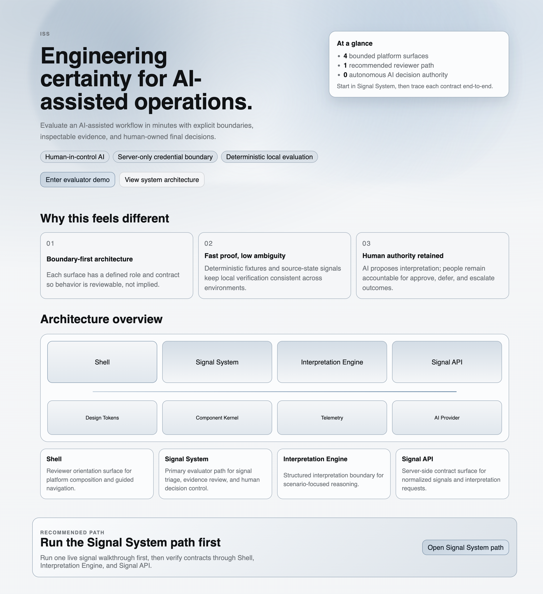

# Intelligent Systems Suite

For a concise public overview and demo entry path, start with [LANDING.md](LANDING.md).

ISS is a boundary-first engineering platform for AI-assisted software systems. The repository is designed to show architecture discipline, operational evidence, and human-in-control decision flows without pretending to be a generalized SaaS product.



*ISS landing page overview: the platform narrative, architecture map, and recommended signal-system entry path.*

## What this repository demonstrates

- explicit app boundaries between shared platform layers and application surfaces
- deterministic local evaluation paths and safe demo-mode fallback behavior
- server-owned credential handling for live runtime integration
- human decision authority over AI-generated interpretation
- reviewable platform composition across the shell, signal system, interpretation engine, and signal API

## Current state

The platform foundation and reference shell are validated for the current scope. The flagship Signal System path and server-mediated interpretation boundary are implemented with local validation evidence captured, but live credentialed provider validation and deployed one-origin validation remain the remaining operational follow-up.

## Architecture

The current-state architecture is documented in [docs/engineering/iss-platform-current-state-diagram.md](docs/engineering/iss-platform-current-state-diagram.md).

Core surfaces include:

- Shell: platform composition reference and demo hub
- Signal System: operational signal review workflow and human decision support
- Interpretation Engine: focused reasoning boundary
- Signal API: server-only integration boundary for normalized signals and server-mediated interpretation

## Quick start

Install dependencies:

```sh
pnpm install
```

Run the main shell hub locally:

```sh
CI=1 pnpm nx serve shell
```

Run the local signal API endpoint for the server boundary:

```sh
pnpm nx serve signal-api --host 127.0.0.1 --port 4300
```

The landing experience is available here during local development:

- http://127.0.0.1:4201/landing

## Documentation index

Start with the engineering and product references here:

- [docs/README.md](docs/README.md)
- [docs/engineering/README.md](docs/engineering/README.md)
- [docs/product/mini-prds/README.md](docs/product/mini-prds/README.md)
- [github/copilot-instructions.md](github/copilot-instructions.md)

## Scope guardrails

This repository is intentionally not positioned as a broad SaaS platform or generalized AI product in the current phase.

The emphasis is on:

- architectural honesty
- boundary clarity
- human validation and accountability
- credible engineering evidence over feature breadth
