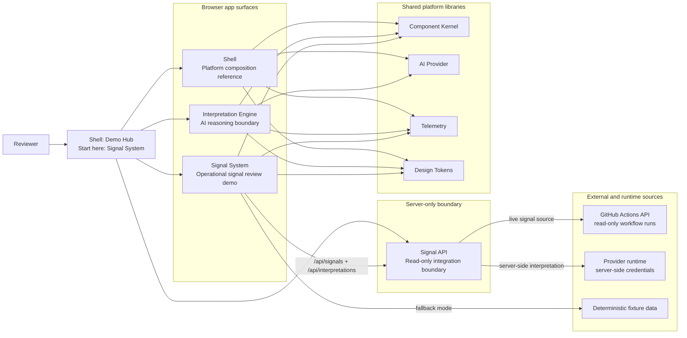
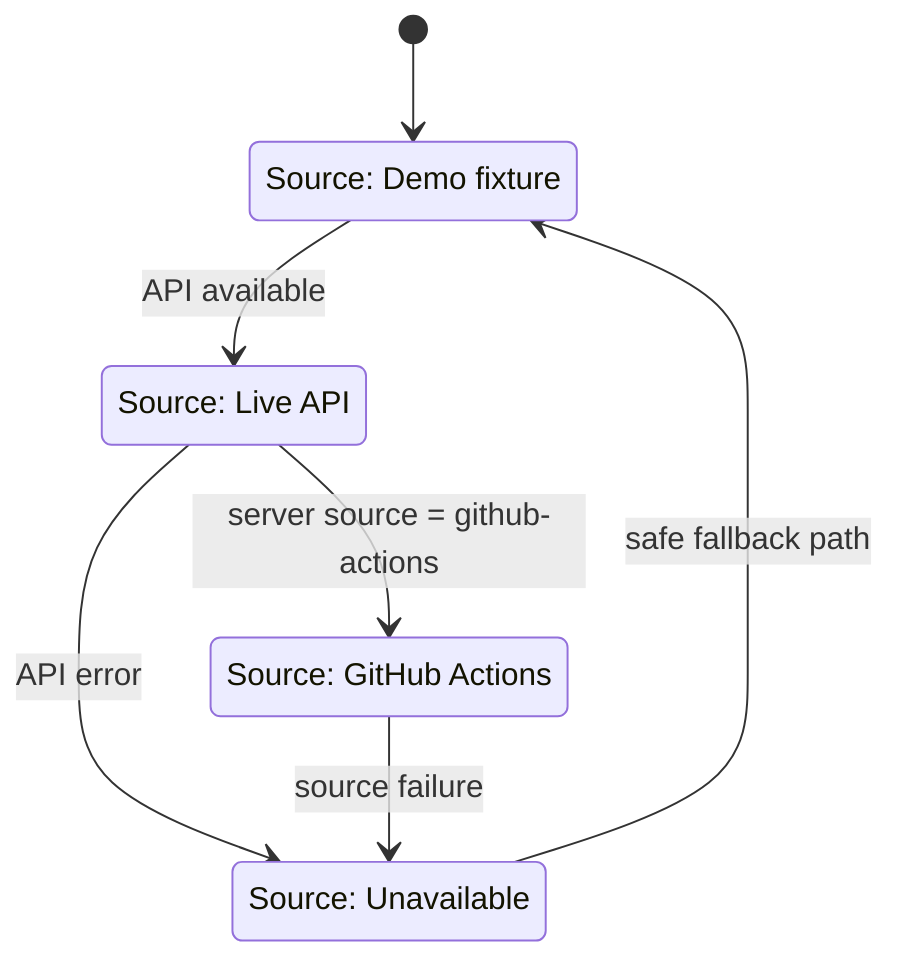

# ISS Platform Current-State Diagram

This diagram captures the current hybrid model: isolated application boundaries with a lightweight demo hub for reviewer clarity.

## Platform and Boundary View

## Signal System Source-State Labels

## Reviewer Notes

- Start in Shell, then open Signal System first.
- Keep architecture honest: app boundaries stay isolated.
- AI output remains support-only; human decision authority remains final.
